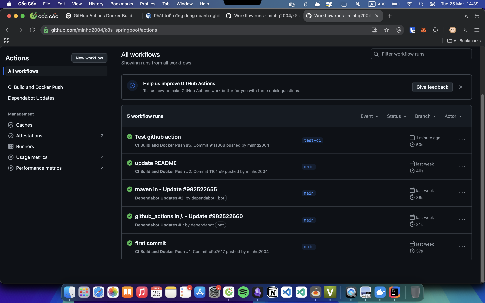

Họ tên: Nguyễn Quang Minh

MSV: 22024547

Bài làm:
- [CI/CD](#bài-tập-spring-boot---github-actions--argocd)
- [K8S](#bài-tập-spring-boot--kubernetes)

# Bài tập Spring boot - Github Actions + ArgoCD
Github action:

Build image in Docker Hub:

# Bài tập Spring Boot – Kubernetes

Deploying To Kubernetes:

Using ConfigMaps To Externalize Configuration:

Service Discovery and Load Balancing

